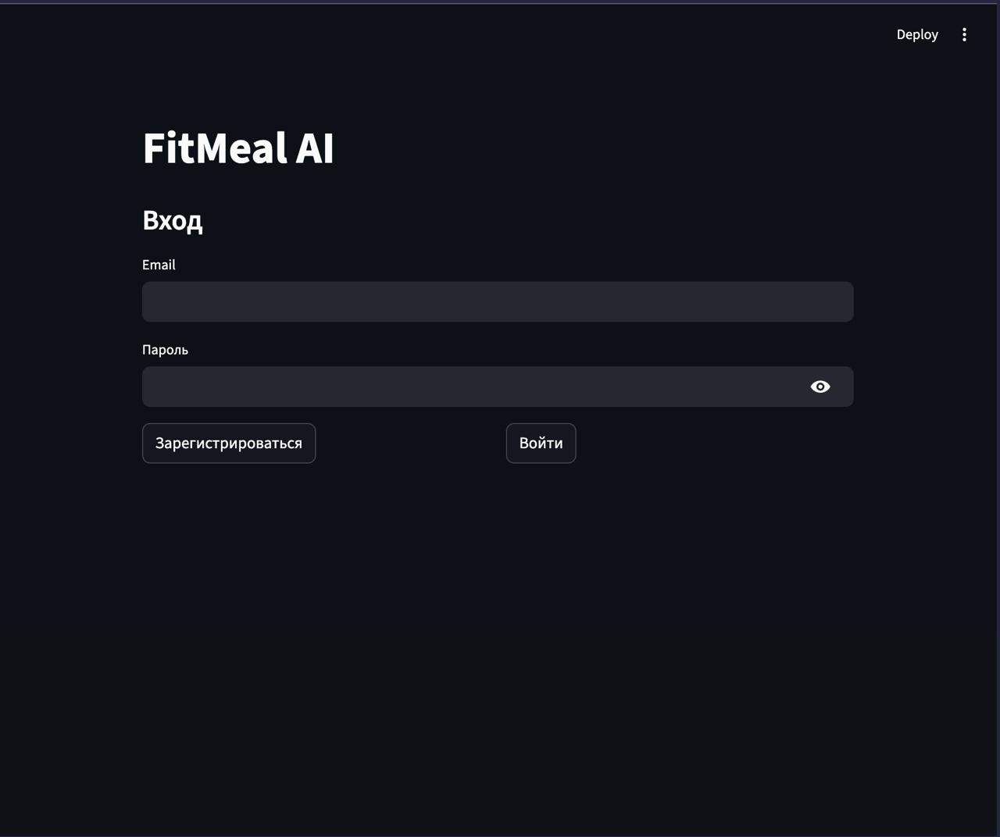
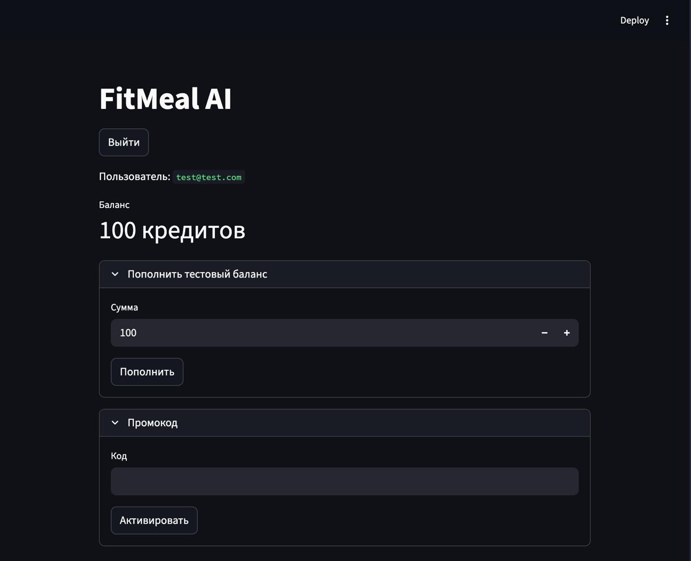
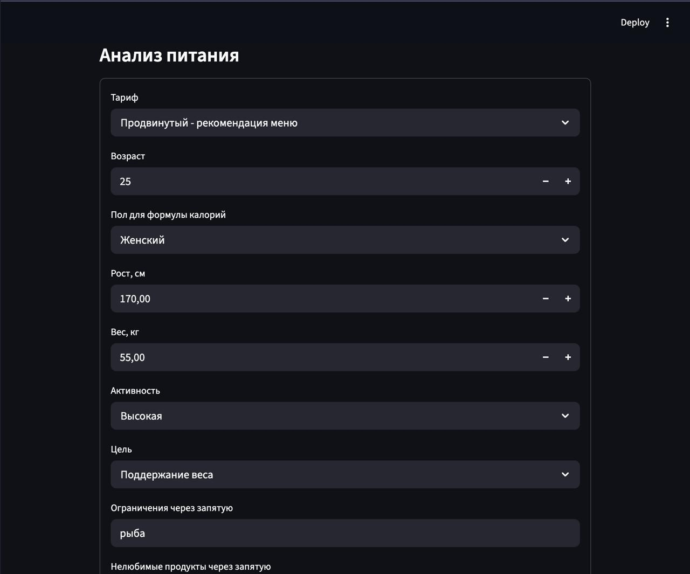
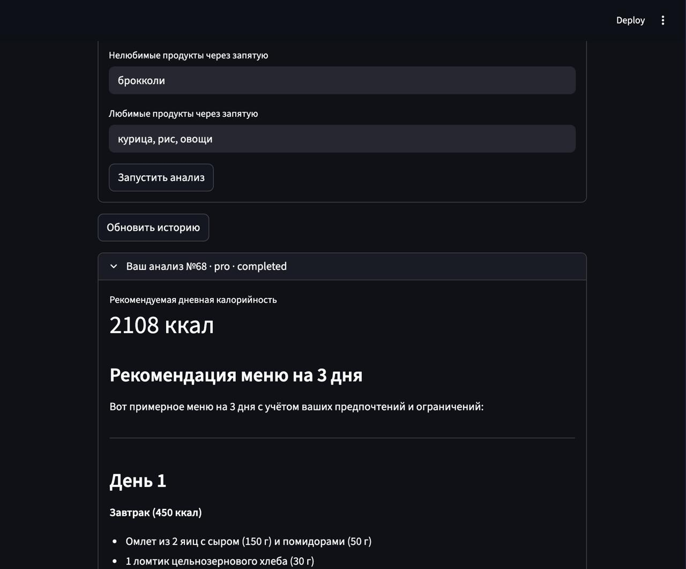
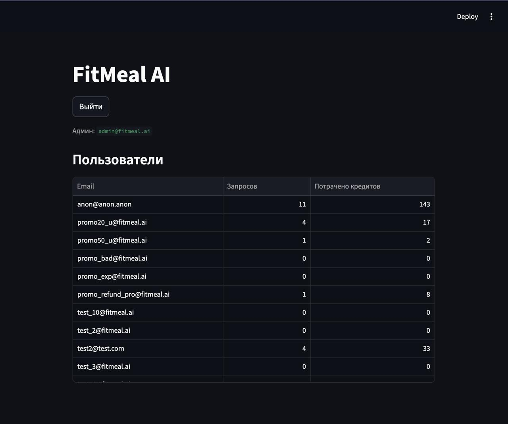
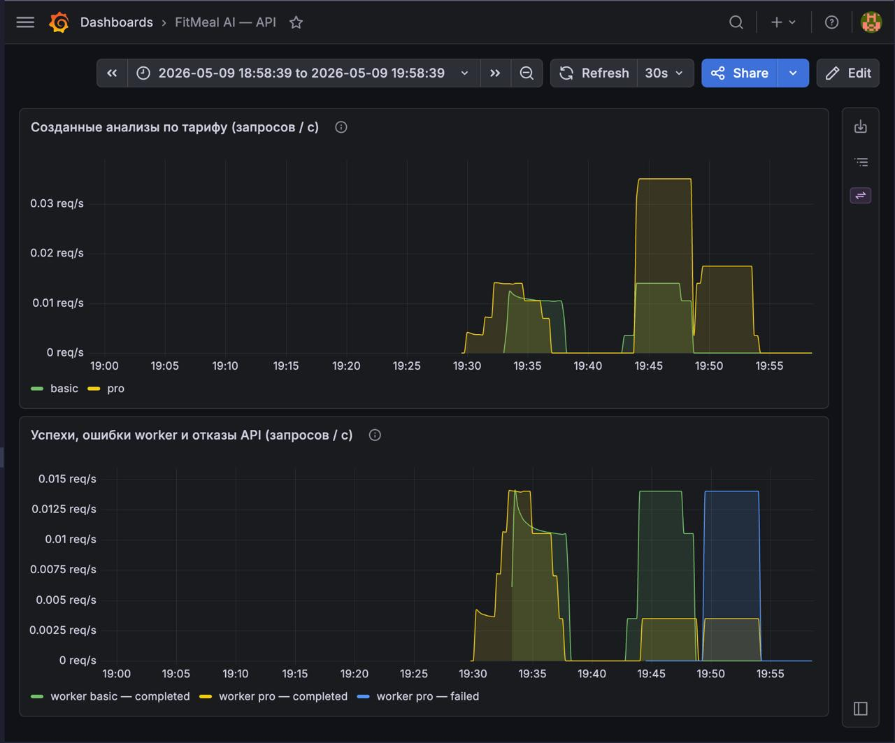
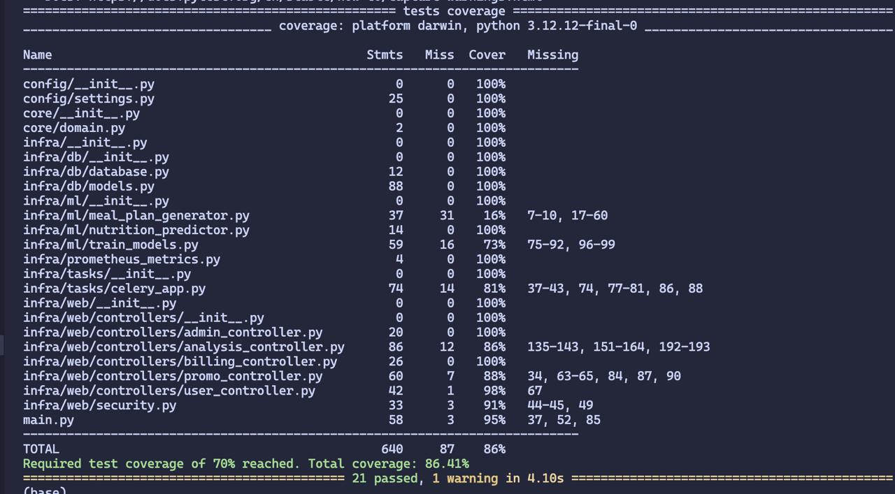

# FitMeal AI

**Демо:** [видео на Google Drive](https://drive.google.com/file/d/1IfLC0oUq1b8bc8KvdliklRut2oOZKekP/view?usp=sharing)

FitMeal AI считает суточную калорийность и по желанию формирует примерное меню на три дня. Базовый тариф — только число (норма от ML-модели). Продвинутый — то же число и сгенерированное меню на три дня: в промпт передаются ограничения по питанию, нелюбимое и любимое из анкеты (отдельного медицинского блока про аллергии нет — только произвольные списки в полях формы). Последняя сохранённая анкета подгружается из базы данных, повторный ввод всех полей не обязателен. Создание анализа возможно только при достаточном балансе кредитов, но списание выполняется в фоновом воркере (Celery) после успешного завершения расчёта; при ошибке ML-модели или сервиса **Mistral.ai** кредиты за этот анализ не списываются.

Платёжный шлюз не используется: новому пользователю начисляется **100 кредитов**, пополнение — изменение баланса в БД через интерфейс приложения (имитация платежа без банка и провайдера).

Базовый запрос — **5** кредитов, продвинутый — **15**: для Pro нужны внешние запросы к **Mistral.ai**. Промокоды **sale50** (скидка 50%, один раз на пользователя) и **sale20three** (скидка 20%, до **трёх** успешных анализов на пользователя, учёт использования промокодов в базе данных).

Развитие проекта:
В перспективе было бы полезно добавить инфографику по изменениям параметров тела и образа жизни, чтобы отслеживать прогресс пользователя. Помимо генерации меню на несколько дней, было бы интересно добавить рекомендацию физической активности и отслеживание метрических параметров тела (объём талии, груди, бёдер и т.д.). Добавить админу возможность добавления новых промокодов через ui.

---

## Особенности реализации

- **Списание после успешного выполнения.** Кредиты уменьшаются в **Celery worker** только после успешного расчёта калорийности и (для тарифа Pro) генерации меню. При сбое ML или **Mistral.ai** задача получает статус `failed`, списания по этому анализу нет.
- **Разделение быстрых и долгих операций.** Базовый тариф использует один **joblib**-пайплайн scikit-learn. Pro повторно использует те же признаки и добавляет запрос к языковой модели; длительная работа выполняется в очереди, HTTP API не блокируется ожиданием ответа LLM.
- **Промокоды.** Поддерживается процентная скидка на цену анализа, ограничение числа применений на пользователя (`max_uses_per_user`), опциональная дата окончания действия; проверки выполняются при активации и при расчёте итоговой стоимости.
- **Мониторинг.** Эндпоинт `/metrics` доступен на сервисе API (метрики по созданным анализам) и на worker (завершение задач по статусу). В составе **docker compose** поднимаются Prometheus и Grafana; источник данных и дашборд **FitMeal AI — API** задаются через provisioning.
- **Интерфейс Streamlit.** Для пользователя с ролью **user** доступен сценарий анализа, биллинга и промокодов; для **admin** после входа отображается статистика по активности (`/api/v1/admin/stats`).

---

## Функциональность

Регистрация и аутентификация (**JWT**), профиль пользователя и учёт баланса кредитов, пополнение баланса и журнал транзакций, активация промокодов, постановка задачи анализа в очередь **Redis** и обработка в **Celery**, история анализов и получение последней анкеты, разделение ролей **admin** и **user**, документация **OpenAPI (Swagger)**, веб-клиент на **Streamlit**, сбор метрик **Prometheus** и визуализация в **Grafana**.

---

## Структура репозитория

```text
.
├── config/settings.py
├── core/domain.py
├── infra/
│   ├── db/
│   ├── ml/
│   ├── tasks/celery_app.py
│   └── web/              # security + controllers
├── monitoring/
│   ├── grafana/
│   └── prometheus/prometheus.yml
├── images/
├── data/
├── models/
├── tests/
├── main.py
├── streamlit_app.py
├── docker-compose.yml
├── Dockerfile
├── requirements.txt
└── pytest.ini
```

---

## Стек

Python **3.11**, FastAPI, SQLAlchemy 2.0, PostgreSQL **16**, Redis **7**, Celery, scikit-learn, pandas, httpx (вызовы Mistral API), Streamlit, prometheus-client; мониторинг — Prometheus и Grafana.

---

## Запуск

### Полный стек в Docker

Требуются установленные Docker Desktop и Git.

```bash
git clone https://github.com/katterns/FitMeal
cd FitMeal
docker compose up --build
```

Имя проекта Compose: **fitmeal-ai**. Запускаются сервисы **api**, **worker**, **postgres**, **redis**, **streamlit**, **prometheus**, **grafana**. Завершение анализа и списание кредитов выполняет **worker**; без работающего worker задачи остаются в очереди.

| Сервис | Адрес |
| ---------- | ----- |
| Swagger | http://localhost:8000/docs |
| Streamlit | http://localhost:8501 |
| Prometheus | http://localhost:9090 |
| Grafana | http://localhost:3000 (**admin** / **admin**, дашборд подключается через provisioning) |

Полный сброс контейнеров и томов с данными PostgreSQL:

```bash
docker compose down -v
```

### Скриншоты

**Streamlit** (`http://localhost:8501`): вход, баланс и промокоды, форма анализа, результат тарифа **Pro** (калории и меню).









**Администратор:** таблица пользователей — число запросов и потраченные кредиты (`/api/v1/admin/stats`).



**Grafana:** дашборд **FitMeal AI — API** (метрики Prometheus).



---

## Конфигурация и доступы

Переменные окружения описаны в `config/settings.py`; для контейнеров значения задаются в `docker-compose.yml`.

| Переменная | Назначение |
| ---------- | ---------- |
| `DATABASE_URL`, `REDIS_URL` | База данных и брокер очереди Celery |
| `JWT_SECRET_KEY` | Секрет подписи JWT |
| `MISTRAL_API_KEY`, `MISTRAL_MODEL`, при необходимости `MISTRAL_BASE_URL` | Генерация меню в тарифе Pro; без ключа запрос к Mistral завершается ошибкой, кредиты не списываются |
| `ADMIN_EMAILS` | Список email через запятую: при регистрации им назначается роль администратора |

При первом запуске приложения создаётся учётная запись **`admin@fitmeal.ai`** с паролем **`admin_fitmeal`**. Новый пользователь при регистрации получает **100 кредитов**. В Streamlit интерфейс администратора ограничен таблицей статистики (`GET /api/v1/admin/stats`); пользователь с ролью **user** работает с анализом, биллингом и промокодами.

**Регистрация и вход:** тело запроса — JSON `{"email":"…","password":"…"}`. Ответ `/login` содержит `access_token`; для остальных методов передайте его в заголовке `Authorization: Bearer <токен>`.

---

## REST API

Все маршруты с методами, телами запросов и схемами ответов описаны в **Swagger/OpenAPI** (`/docs` у работающего API).

Цены тарифов задаются в настройках (`basic_tariff_price`, `pro_tariff_price`; значения по умолчанию совпадают с описанием во введении). Промокоды уменьшают стоимость заказа анализа на заданный процент (с округлением итоговой стоимости). Текст меню для тарифа Pro возвращается в поле **`meal_plan_text`**.

---

## Тесты

```bash
pytest
```

Из виртуального окружения: `.venv/bin/python -m pytest`.

| Файл | Что проверяется |
| ---- | ---------------- |
| `tests/test_api.py` | REST (**TestClient**): `/`, `/health`; регистрация, вход, ошибки дубликата и пароля, доступ только с JWT; пополнение и транзакции; анализ **basic** и неуспешный **pro** без Mistral; отсутствующий анализ; недостаточный баланс; **admin/stats** (доступ и данные); промокоды (скидки **sale50** / **sale20three**, истечение срока, неизвестный код, скидка после неудачного **pro**). |
| `tests/test_ml.py` | Формула целевых калорий для синтетики, препроцессор **sklearn**, запись синтетического CSV, предсказание **`NutritionPredictor`** по `calorie_model.joblib`. |
| `tests/conftest.py` | Не тесты: общая подготовка (SQLite, схема БД, eager Celery, ключи окружения). |

Покрытие **≥ 70%** — `pytest.ini` и pytest-cov; исключения — `.coveragerc`.


